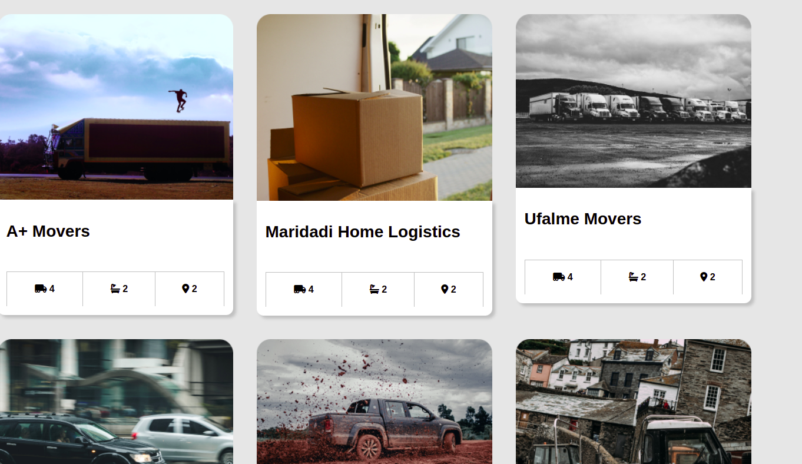

# Quick Movers
 ## By Ezra Njeru
## Screenshot
 
 ## Table of Content
 - [Description](#description)
 - [Features](#features)
 - [Requirements](#requirements)
 - [Installation Process](#installation-Process)
 - [Live Link](#Live-Link)
 - [Technology  Used](#technology-Used)
 - [Licence](#licence)
 - [Authors Info](#Authors-Info)
 ## Description
 
This project is a web application for Quick Movers that shows details about the services it offers, has information about the moving company, a portfolio section and a form that enables users to send their requests and concerns to Quick Movers

## Features

As a user of the application,you will be able to :
1. See a description of what the services offered by the moving company
1. Can make inquiry through a form.
[Go Back to the top](#Quick-Movers)
 ###  Requirements
 * Access to  a computer or any other garget
 * Access to internet
 ### Installation Process
 ****
* Clone to the repo : git clone https://github.com/Ezra-code/Quick-Movers
* Unzip the downloaded files in a folder of choice.
* Open the index file from the zipped file with any browser.
 ****
 [Go Back to the top](#Quick-Movers)
### Live Link
- Click this link to view the live application https://ezra-code.github.io/Quick-Movers/
### Technology  Used
* HTML - which was used to develope the structure off the pages.
* CSS - which was used to style the User Interface.

[Go Back to the top](#Quick-Movers)
## Instructions
* The website is not responsive can only be used on a desktop
## Licence
This project is licensed under the terms of the MIT license
[Go Back to the top](#Quick-Movers)
## Authors Info
Ezra Njeru Kithinji
